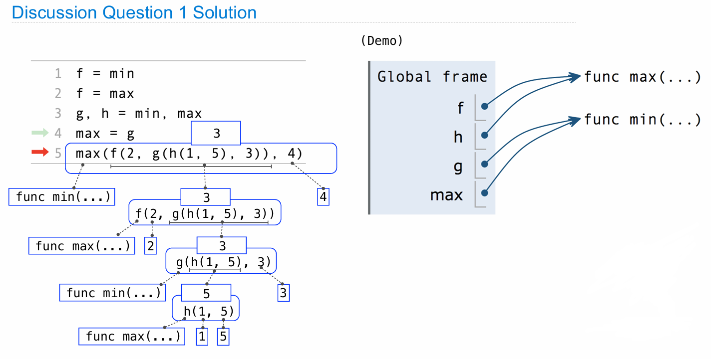

# Lecture 2. Functions

---

## 表达式的基础
表达式描述了一种计算，并求值为一个值。这种描述计算的方法并非计算机科学独有，数学家长期以来一直在使用表达式来组合不同的数字。例如，使用加号 `+` 来表示两个数字的加法，使用分数线来表示除法，使用小房子来表示平方根等。所有这些都是表达式的不同表现形式。


### 函数调用表示法
计算机科学家倾向于使用函数调用表示法来表达所有的计算，而不是使用各种不同的数学符号。函数调用表示法（如 `f(x)` 或 `f(x, y)` 等）被认为是其他表示法的泛化。这种方法简化了各种计算的表达方式，使其统一为一个通用的形式。

### Python作为计算器
Python非常强大，可以用作计算器处理复杂的数学运算。通过输入表达式，如 `2005 + 6`，Python解释器可以立即显示结果。Python支持多种运算，包括乘法、除法、乘方等，并能通过括号来管理运算的优先级。

### 调用表达式的使用
调用表达式是一种特殊的表达式形式，它通过指定一个函数和一些参数来进行函数调用。例如，`max(2, 4)` 会调用 `max` 函数来找出 2 和 4 中的最大值。调用表达式的优点在于，它可以将多个值组合在一起，并且可以嵌套使用。

### Python中的导入和函数调用
在 Python 中，某些函数（如 `add` 和 `mul`）需要通过导入才能使用。一旦导入，就可以使用这些函数来替代传统的算术运算符，例如使用 `add(2, 3)` 来进行加法运算。这展示了调用表达式的灵活性和强大功能。

### 表达式的结构和求值过程
调用表达式由操作符和操作数组成，都包含在括号内。操作符位于括号前，操作数则位于括号内，用逗号分隔。求值过程包括首先求值操作符和操作数表达式，然后将求得的函数应用于操作数的值。


## 嵌套调用表达式的执行过程

### 调用表达式的求值
在之前的Python解释器示例中，我们试验了一个嵌套调用表达式，并得到了208这个结果。Python解释器是如何执行这个表达式的呢？实际上，它应用了标准的求值程序。当解释器遇到一个调用表达式时，它首先识别出这是一个调用表达式（由于存在括号），然后按顺序求值操作符（即函数）和第一个操作数，该操作数自身也是一个调用表达式，因此该程序再次被应用。

### 求值过程的深入
在求值过程中，首先求值的是函数`add`，然后是操作数2，接着是另一个调用表达式`mul(4, 6)`。通过对`mul`函数和数字4及6的求值，得到24。这个值是内部子表达式的结果。接下来，可以将函数`add`应用于2和24，得到26。这完成了第一个操作数的求值。

### 完成剩余操作数的求值
之后，解释器需要求值最后一个操作数，以便完成乘法操作。这涉及到另一个调用表达式`add(3, 5)`，求值后得到8。最终，将26乘以8得到208。


### 表达式树的说明
该过程可以通过一个称为表达式树的图示来更好地理解。在表达式树中，每个节点都表示一个操作或求值步骤，从叶节点（表示简单的数值或函数）到根节点（表示最终表达式的求值结果）。这种结构显示了表达式求值的顺序和组织方式。


### 重要观察
在这一过程中，必须先确定某些值（例如，先求出26和8）才能进行最后的乘法操作。这显示了求值顺序的重要性，以确保在进行最终计算前已经获得了正确的信息。整个求值过程是一系列重复应用同一求值程序的实例，这体现了计算表达式时程序的系统性和一致性。

## 环境图解

### 环境图解的目的与定义
[环境图解](https://pythontutor.com/)是用于可视化Python解释器执行程序的过程的工具。这种图解帮助我们跟踪程序中变量名与值之间的绑定关系。计算机科学家常常通过绘制包含盒子和箭头的图解来描述问题和解决方案，环境图解正是这种方法的实际应用。

### 环境图解的组成
环境图解通常由左侧的代码区和右侧的框架区组成：
- **代码区**：显示实际的Python代码，包括各种语句和表达式。代码执行的位置通过箭头指示，灰色箭头表示刚执行过的语句，红色箭头指示下一条将要执行的语句。
- **框架区**：展示变量名与其绑定的值之间的关系。每个框架中，一个变量名（如`pi`）绑定到一个特定的值。框架确保每个变量名在其作用域内只绑定一次，重绑定将会使旧的绑定失效。


### 环境图解的实际应用
环境图解不仅帮助理解简单的代码执行，当程序中有大量变量和复杂的作用域时，这种图解尤其重要。通过环境图解，我们可以清楚地看到每个变量在不同时间点的值，以及它们是如何随着程序的运行而改变的。

### 在线工具的使用
 [Python Tutor](https://pythontutor.com/visualize.html#mode=edit) 是一个实用工具，可以自动生成环境图解。用户可以在这个平台上输入代码，通过“Visualize Execution”按钮生成环境图解，并逐步查看代码执行的每个步骤，从而深入理解程序的执行过程。

### 赋值语句的执行规则
Python中赋值语句的执行遵循固定的规则：首先从左到右评估等号右侧的所有表达式，然后将得到的值绑定到等号左侧指定的变量名上。这个过程在环境图解中清晰可见，使得理解多变量赋值和复杂表达式的赋值变得直观。


## 复杂调用表达式的求值

### 初始绑定和重绑定
在一个复杂的赋值序列中，首先，`f`被绑定到了`min`函数，随后`f`被重新绑定到`max`函数。这个过程演示了在环境中，一个名称在一个作用域内只能绑定到一个值，重绑定会导致原有绑定的丢失。

### 多重绑定与函数应用
接下来，`g`和`h`被分别绑定到`min`和`max`。这种绑定演示了如何将不同的函数名绑定到已知的函数上，展示了函数别名的概念。此时，`g`和`max`都指向了`min`函数，而`h`指向了`max`函数。

### 调用表达式的嵌套求值
在这种复杂的调用表达式中，`max(f(g(h(1, 5)), g(3)), max(4))`涉及到多个层次的函数调用。求值过程如下：
1. **求解操作符和操作数**：首先求解最外层的`max`，此时`max`已被重新绑定到`min`函数。
2. **递归求解内部表达式**：内部的`g(h(1, 5))`和`g(3)`会依次求解。`h(1, 5)`调用`max`返回5，因为`h`绑定到了`max`；`g(3)`调用`min`返回3，因为`g`绑定到了`min`。
3. **继续求解并合并结果**：外层的`max`（现为`min`）将比较`min(5, 3)`和4，最终`min`将这些值归约为3。

### 环境图解的视觉化
通过环境图解，我们可以可视化地跟踪这一整个求值过程。图解显示了代码执行的每一步，如何变量名与函数绑定以及它们如何随着代码的执行而变化。



## 函数定义与环境图解

### 函数定义的重要性
在Python中，定义函数是实现抽象的一个重要方式。通过`def`语句，我们不仅将名称绑定到简单值，而且可以绑定到复杂的表达式或语句上，这种方式允许我们将复杂的计算封装在一个名称下，并简化对其的处理。

### `def`语句结构
函数通过`def`语句定义，该语句的结构包括：
- 关键词`def`；
- 函数名称；
- 形式参数列表，括号内列出，用于引用传递给函数的实际参数值；
- 冒号和缩进，后面跟着函数体，通常是一个或多个语句，定义了函数的行为；
- 返回语句，定义函数调用的结果。


### 执行`def`语句的过程
执行`def`语句时，解释器按以下步骤操作：
1. 创建一个新函数，其特征由`def`行上的函数签名确定；
2. 将函数体（缩进后的所有内容）设置为新创建的函数的一部分，但不立即执行这些代码；
3. 在当前环境的帧中，将函数名绑定到新创建的函数对象上。

### 环境图解的作用
环境图解帮助我们可视化Python解释器在执行程序时的内部状态，特别是如何跟踪名称和值之间的绑定。这些图解通过绘制代码和帧的方式，显示了代码执行的每一步以及名称如何与值关联。

### `def`语句的求值过程
当定义函数时，实际的函数体并不立即执行；而是当函数被调用时，才根据定义时捕获的环境执行。这包括：
- 创建一个新的局部帧；
- 将函数的形式参数绑定到传入的实际参数值；
- 在这个新的环境中执行函数体。

### 示例解析
通过定义一个简单的`square`函数来展示这一过程：
```python
def square(x):
    return x * x
```
在调用`square(-2)`时，首先评估函数名和参数，然后在新的局部帧中绑定参数`x`到值`-2`，执行函数体得到结果`4`。


## 名称查找与环境结构

### 环境的角色与定义
在Python中，每个表达式的求值都在一个特定的环境上下文中进行。环境是解释器用来跟踪名称与值之间对应关系的内存结构。当前的环境通常包含一个全局帧，或者在使用用户定义的函数时，还可能包含一个局部帧。这些帧是环境图解中的方框，代表名称与值之间的绑定。

### 环境的序列结构
环境可以被视为一系列帧的序列，其中每个帧都包含一组名称到值的绑定。在查找名称的值时，解释器会从当前环境的第一个帧（通常是局部帧）开始搜索，如果在那里找不到，就会继续到下一个帧（全局帧）查找。这种结构确保了名称解析的顺序性和层次性。

### 名称查找过程
当需要评估一个名称时，解释器将检查当前环境中的每个帧，以确定该名称绑定的值。这个查找过程从局部帧开始，如果局部帧中存在该名称，则使用其值；如果不存在，再继续到全局帧查找。这样的查找顺序确保了函数内部的局部变量可以覆盖同名的全局变量。

### Python中的名称查找示例
例如，在定义并调用`square`函数时，如果函数体内使用了与形参同名的局部变量（即`square`），那么在该函数内对`square`的所有引用都将指向这个局部变量，而不是全局环境中的任何同名实体。这表明了局部环境对名称解析的优先权。

### 名称查找与环境图解工具
使用在线Python教学工具（如Online Python Tutor）可以可视化这一过程，通过环境图解清楚地展示每一步的执行结果和环境状态。这种工具对于理解复杂的名称绑定和函数调用流程非常有帮助，尤其是在涉及多层名称隐藏和覆盖时。
