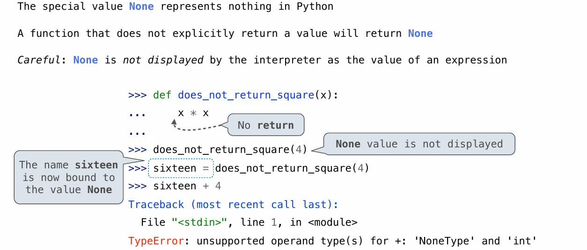
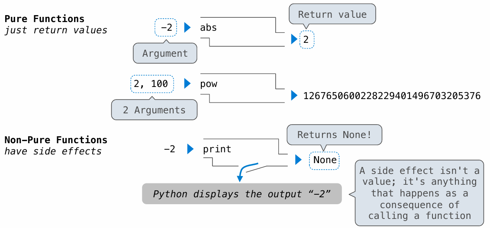
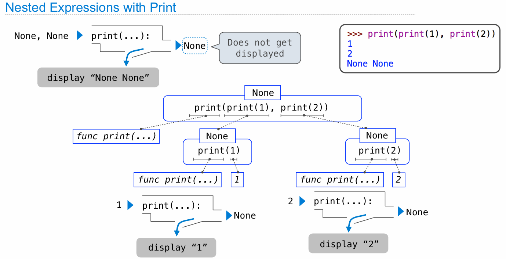
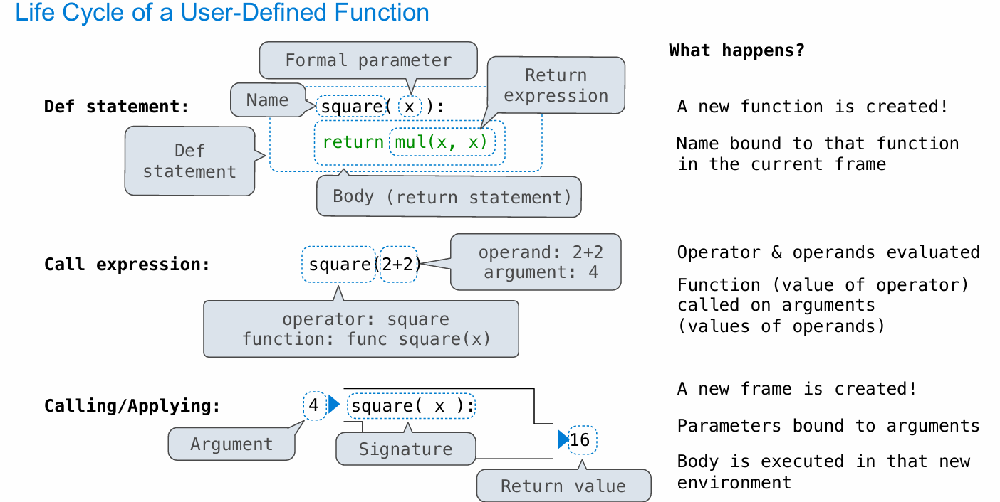
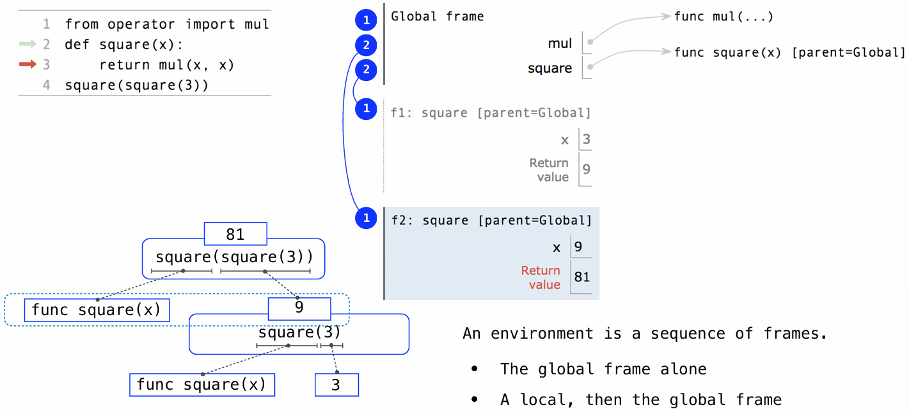
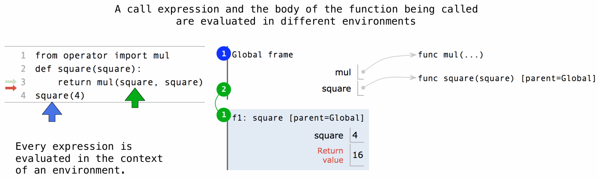
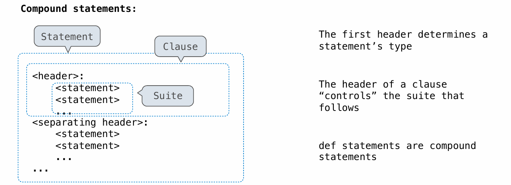
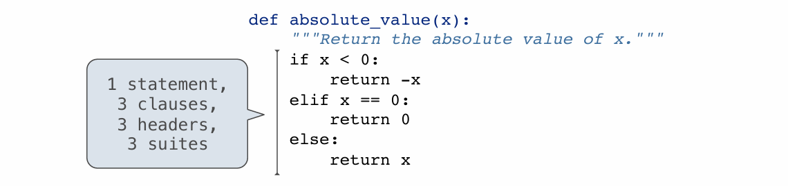
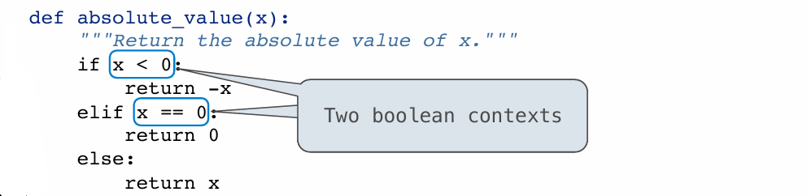
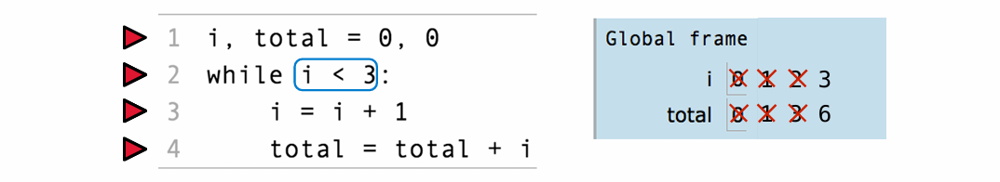

# Lecture 3. Control

---

## Python 中的打印与求值

本部分讨论了在Python中打印与表达式求值之间的区别，以及如何理解特殊值 `None` 的显示行为。

### 表达式求值与打印

在Python交互式解释器中，直接输入一个表达式，如数字 `-2` 或字符串 `'go bears'`，解释器会显示表达式的值。这种情况下，字符串显示时会包括引号，显示的是字符串字面量的确切形式。相反，使用 `print` 函数打印同一个字符串时，输出结果中不包含引号，显示的是字符串的实际内容。

### `None` 的特殊行为

`None` 在Python中用来表示空或无值的情况。如果直接在解释器中求值 `None`，由于它代表“无”，所以默认不会显示任何东西。但是，如果使用 `print` 函数打印 `None`，则会在控制台上显示 "None" 字样。这揭示了 `print` 和直接求值之间的一个关键区别：`print` 能够显式地显示 `None`，而直接求值时 `None` 被视为不显示。

### 函数返回 `None`

在Python中，如果一个函数没有显式地返回一个值，它会默认返回 `None`。例如，一个只计算但不返回值的函数，如计算 x 的平方但不使用 `return` 语句，将返回 `None`。这种情况下，虽然操作被执行了（如计算了 x 的平方），但由于没有返回值，所以调用此函数的结果是 `None`。

### 打印与副作用

`print` 函数不仅可以打印多个值（包括 `None`），而且还支持连续打印操作。例如，嵌套 `print` 调用将展示如何在函数调用中处理 `None`。当 `print` 被嵌套调用时，外部的 `print` 尝试打印内部 `print` 的结果，因为内部的 `print` 返回 `None`，所以最终输出的是 "None None"。



### 纯函数与非纯函数

在Python中，函数分为纯函数和非纯函数。纯函数（如 `abs` 和 `pow`）仅基于输入计算并返回值，没有副作用。非纯函数（如 `print`），除了可能有返回值外（通常是 `None`），还有副作用，如输出到控制台。这种副作用是函数的一部分行为，不是返回的值，而是由函数调用引起的行为改变。



## Python中的嵌套打印调用和执行环境

本部分将探讨Python中嵌套打印调用的行为及其对表达式求值的影响，并解释用户定义函数的执行环境。

### 嵌套打印调用的解析

在Python中执行嵌套的 `print` 调用如 `print(print(1), print(2))` 时，会出现一系列的输出和求值步骤：
1. **第一个 `print(1)` 调用**：执行时，首先打印数字 `1`（这是一个副作用），然后返回 `None`。
2. **第二个 `print(2)` 调用**：同样打印数字 `2`，返回 `None`。
3. **外层的 `print(print(1), print(2))` 调用**：接收到两个 `None` 作为参数，导致打印出 "None None"。

这个过程说明了 `print` 函数的副作用（即打印输出）和它的返回值（始终是 `None`）。解释器不会在最终的表达式求值结果为 `None` 时自动打印它。



### 用户定义函数与执行环境

讨论用户定义函数时，理解Python的执行环境非常关键。以下是创建和调用用户定义函数的步骤：
1. **定义 (`def`) 语句**：通过 `def` 语句定义函数，指定函数名和形参。函数体包含在定义之后的缩进块中。
2. **函数调用**：调用一个函数时，Python首先评估调用表达式中的操作数和操作符，然后将实际参数传递给函数。
3. **环境框架**：每次函数调用时，Python都会创建一个新的环境框架，其中形参被绑定到传入的实际参数上。
4. **函数体执行**：在新的环境中，执行函数体，返回计算结果。

例如，定义一个名为 `square` 的函数，计算输入值的平方，然后通过传入参数（如 `2+2`）调用此函数，最终返回计算结果 `16`。



### 函数调用与值的传递

在Python中，函数的调用涉及到值的传递，即将表达式的结果（如 `2+2` 的结果 `4`）传递到函数中。这种机制支持了函数的封装性和独立性，允许函数在隔离的环境中执行操作，而不影响全局环境。

## Python中函数调用和执行环境的复杂例子

本部分探讨了如何通过嵌套函数调用来理解Python中的执行环境和作用域。

### 嵌套函数调用过程

在Python中，我们可以通过嵌套调用同一个函数来进行更复杂的计算，例如计算 `square(square(3))`。这里的流程包括：
1. **第一层函数调用**：首先计算 `square(3)`。这涉及到：
   - 创建一个新的执行环境（帧）。
   - 将形式参数 `x` 绑定到实际参数 `3`。
   - 执行函数体，计算 `x * x` 得到 `9` 作为返回值。
2. **第二层函数调用**：使用第一次调用的结果 `9` 来调用 `square(9)`，重复上述过程，得到最终结果 `81`。

### 执行环境和帧

在每次函数调用中，Python都会创建一个新的帧来存储局部变量和参数。每个帧都是独立的，并根据传入的参数进行不同的处理：
- **帧标识**：每个帧都有一个独特的标识（例如 F1, F2），以区分不同的函数调用实例。
- **参数绑定**：每次调用都会将形式参数绑定到实际传入的参数上，这决定了函数体内部的计算方式。



### 多环境结构

Python中的执行环境可以由多个帧组成，其中包括：
- **全局帧**：存储全局变量和函数定义。
- **局部帧**：每次函数调用时创建，存储局部变量和参数。

在执行嵌套函数调用时，Python会维护一个由多个帧构成的环境链，每个帧都可以访问到它之前的帧中定义的变量和函数。

### 名称解析和作用域

在这种多环境结构中，变量名的解析遵循从内到外的顺序，即先从当前帧查找，如果未找到，则继续在上一层帧中查找，直至全局帧。这一过程确保了名称在各自的作用域内有明确的绑定和解析，从而支持了Python的作用域规则和变量隐藏（shadowing）现象。

## Python 函数执行和环境的复杂示例

本部分进一步探讨了Python中的函数调用、执行环境和名称解析。

### 名称在不同环境中的含义

在Python中，相同的名称在不同的环境中可以有不同的含义。这是因为每个执行帧可以为相同的名称绑定不同的值。例如，函数的调用表达式和函数体被调用时，都在不同的环境中评估。

### 函数参数与局部变量的区别

在一个示例中，函数名称 `square` 被用作函数本身的名称及其形式参数。尽管这样做不推荐，但这有效地展示了当函数被调用时，参数名称如何在局部帧中覆盖全局定义。例如，调用 `square(4)` 实际上会在函数的局部环境中将 `square` 绑定到数字 `4`，而不是函数本身。



### 函数执行的环境切换

当 `square(4)` 被调用时，首先在全局环境中解析函数名称 `square`，然后创建一个新的局部帧执行函数体。在这个局部帧中，形式参数 `square` 被绑定到实际参数 `4`。当函数体内部的 `square` 被求值时，它指向的是参数 `4` 而不是全局的函数。

### 多环境结构的重要性

Python中的多环境结构允许函数调用在隔离的环境中执行，保证了函数执行的独立性和变量作用域的控制。每次函数调用都可能创建一个新的局部环境，这些环境形成了一个包含全局环境的环境链。

### 环境链和名称解析

每个环境由一系列帧组成，其中每个帧可能包含变量的绑定。解析一个名称时，Python从当前帧开始，向上通过环境链查找，直到找到名称的绑定或达到全局环境。这确保了在最接近的环境中找到最具体的绑定。

通过理解Python中的函数调用、执行环境、名称解析和环境链，开发者可以更好地管理和预测程序的行为，尤其是在涉及复杂作用域和多函数调用的情况下。这有助于编写更为可靠和可维护的代码，同时避免常见的编程错误。

## 条件语句及其结构

本部分讨论了Python中的条件语句的使用和其基本结构，这对于编写根据不同条件执行不同操作的函数至关重要。

### 语句和复合语句

在Python中，语句是解释器执行的一段代码，用于执行某些操作，如赋值、定义函数等。复合语句包括一个或多个子语句（称为“套件”），这些子语句依据特定的控制结构来执行。每个复合语句都以一个头部开始，后跟一个或多个由缩进的套件组成的序列。



### 条件语句的构造

条件语句允许程序根据表达式的真值来选择性地执行代码块。基本的条件语句由以下部分组成：
- `if` 子句：这是条件语句的开始，包含一个条件表达式。
- `elif` 子句（可选）：代表“else if”，用于链式的条件判断。
- `else` 子句（可选）：在所有先前条件均不满足时执行。

### 执行条件语句的规则

条件语句的执行基于以下规则：
1. 依次评估每个子句的头部表达式。
2. 如果表达式的值为真，则执行相应的套件，并跳过剩余的子句。
3. 如果表达式为假，则继续评估下一个条件表达式（如果有的话）。

### 布尔环境和表达式评估

条件语句中的表达式被视为布尔环境，这意味着表达式的值只用于判断真或假。Python中定义了哪些值为假（如`False`、`0`、空字符串`''`、`None`等），而所有其他的值都被视为真。





### 条件语句的应用实例

通过定义一个计算绝对值的函数，展示了如何使用条件语句。这个函数检查一个数字是否小于、等于或大于零，并根据这些条件返回相应的值。这不仅是对条件语句功能的展示，也是对如何在Python中执行基本算术和逻辑操作的基础教程。

### 条件语句的重要性

理解并能正确使用条件语句是编程中的一个基本技能，它允许程序根据不同的运行时条件做出反应，从而执行更复杂的任务和决策。通过掌握这些结构，程序员可以编写更灵活和强大的代码，更好地控制程序的行为。

## Python中的迭代和while语句

本部分详细讨论了Python中使用 `while` 语句进行迭代计算的过程和规则。

### 迭代的基本概念

迭代指的是重复执行某个过程多次，直到满足特定条件。在编程中，迭代是一种基本的构建块，用于执行重复任务。

### 使用while语句进行迭代

`while` 语句是Python中实现迭代的一种方法。它是一个复合语句，包含一个条件表达式和一个或多个需要重复执行的语句（称为循环体）。

### while语句的结构和执行规则

以下是`while` 语句的基本结构和执行步骤：
1. **条件判断**：`while` 语句以一个条件表达式开始。如果条件为真（true），则执行循环体内的语句。
2. **执行循环体**：循环体内的语句被执行。
3. **重复执行**：执行完循环体后，解释器返回到条件表达式进行再次判断。如果条件仍为真，则重复执行循环体。这个过程一直持续到条件表达式为假（false）。



### 示例：计算数字总和

通过一个简单的示例来说明`while` 语句的用法：
- 初始设置变量 `i` 和 `total` 都为0。
- 使用 `while` 语句累加数字1到3。条件表达式为 `i < 3`。
- 在每次迭代中，`i` 递增1，`total` 增加当前的 `i` 值。

### 循环过程详解

在上述示例中，每次循环迭代都遵循以下步骤：
1. **评估条件**：检查 `i < 3` 是否成立。
2. **执行循环体**：如果条件为真，增加 `i` 的值，更新 `total` 的值。
3. **回到条件评估**：完成循环体后，再次检查条件，如果为真，则继续执行循环体。如果为假，结束循环。

### 循环的结束

当 `i` 增加到3时，条件 `i < 3` 不再成立，循环结束。此时，`i` 的值为3，`total` 的值为6（1+2+3的总和）。

## 使用While语句计算素数分解

本部分讲解了如何利用 `while` 语句在Python中找到任何正整数的素数分解，这是一个更复杂的例子，展示了 `while` 语句在解决实际问题中的应用。

### 素数分解的定义

素数分解指的是将一个正整数 \( n \) 分解为几个素数的乘积，这些素数的乘积等于原始的数 \( n \)。每个正整数都有一组唯一的素数分解（忽略因数的顺序）。

### 素数分解的计算方法

为了找到一个数的素数分解，可以使用以下步骤：
1. **寻找最小的素数因子**：从最小的素数开始，找到可以整除给定数字 \( n \) 的素数。
2. **除以素数因子**：将 \( n \) 除以这个素数因子，得到的商作为新的 \( n \)。
3. **重复过程**：重复以上两步，直到新的 \( n \) 为 1。

### 使用While语句实现

通过 `while` 语句实现上述过程：
- 初始化 \( n \) 为需要分解的数。
- 使用 `while` 语句重复查找最小的素数因子，直到 \( n \) 减小到 1。
- 在每次迭代中，打印出找到的素数因子，并更新 \( n \)。

### 函数定义和实现

### prime_factor 函数

这个函数的目的是打印出一个整数 `n` 的所有素数因子，直到所有的因子都被找出来。函数采用了一个 `while` 循环，持续进行直到 `n` 降至 1。

```python
def prime_factor(n):
    """Print the prime factor of n in non_decreasing order
    
    >>> prime_factor(8)
    2
    2
    2
    >>> prime_factor(11)
    11
    >>> prime_factor(858)
    2
    3
    11
    13
    """
    while n > 1:
        k = smallest_prime_factor(n)  # 调用 smallest_prime_factor 函数获取最小素数因子
        print(k)                      # 打印这个素数因子
        n //= k                       # 更新 n，除以当前的素数因子，进行下一轮循环
```

- **功能**：通过持续找出并打印整数 `n` 的最小素数因子，直到 `n` 降至 1。
- **过程**：使用 `while` 循环检查 `n > 1` 条件，然后找到 `n` 的最小素数因子（通过 `smallest_prime_factor` 函数），打印该因子，并用这个因子去除 `n` 更新其值。

### smallest_prime_factor 函数

此函数用于找出给定整数 `n` 的最小素数因子。它通过从 2 开始逐一尝试直到找到可以整除 `n` 的最小整数。

```python
def smallest_prime_factor(n):
    i = 2  # 从最小的素数开始
    while n % i != 0:
        i += 1  # 如果当前 i 不能整除 n，增加 i
    return i  # 返回可以整除 n 的最小整数 i
```

- **功能**：找到并返回整数 `n` 的最小素数因子。
- **过程**：从 2 开始，逐一检查每个整数是否能整除 `n`，一旦找到能整除的整数，立即返回。

### 整合与测试

将上述代码整合到Python脚本中，并进行测试，以确保它可以正确地为各种整数找到素数分解。可以通过实际的输入和预期输出来验证函数的正确性。

通过 `while` 语句实现的素数分解示例不仅展示了 `while` 语句在实际应用中的强大功能，也提供了一个实际问题解决方案的模板，即如何通过迭代过程解决问题。此外，它也强调了函数定义和循环控制结构在Python程序设计中的重要性。