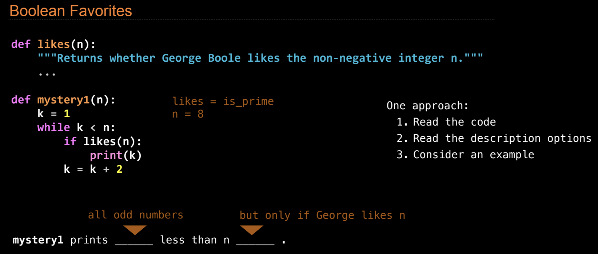
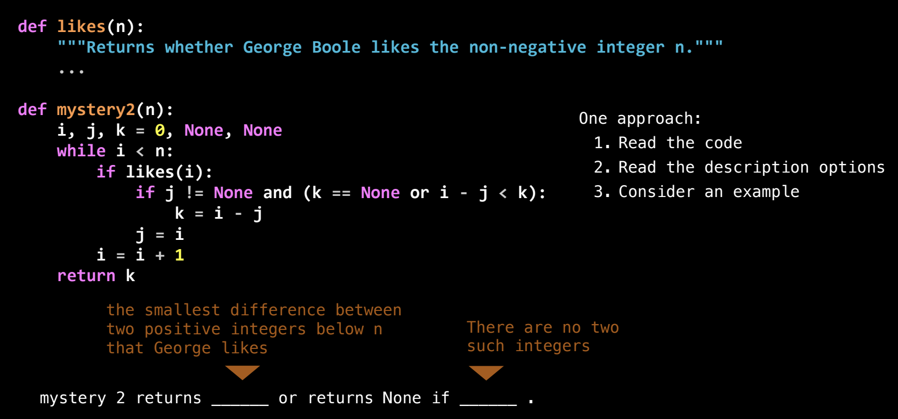

# Lecture 7. Function Examples

## Announcements

期中考试一将于**周一晚上7点**举行。如果你需要调整考试时间，或申请免除监考政策，请务必在**今天**完成申请。考试期间，你需要使用**Zoom**、**Loom**或手机录制屏幕和头部，我们试图让这一过程尽量灵活、不那么繁琐。建议你提前练习录制一个2小时的视频，确保考试当天一切顺利运行。

### Practice Exam

**练习考试**将在**周五下午1点到2点**和**晚上7点到8点**进行。如果你无法参加这两个时间段的练习考试，考试将在**周五晚上8点**至**周日晚上8点**的48小时内开放，可以自行安排时间。练习考试虽然比正式考试短，但强烈建议你参加，这样你可以熟悉考试的软件环境并进行适当的练习。

### 考试规则

- 你可以准备一张**双面的笔记**，但必须自己创建。
- 你可以使用草稿纸。
- 如果要存储笔记电子版，必须使用Google文档，并授予我们编辑权限以便查看文档内容。
- 学生组织**HKN**将在**周六**举办复习会，详情见Piazza帖子。

### 其他重要信息

- **本周五**将有一次**考试准备环节**，这是每周五的惯例。
- **下周没有实验和作业**，也没有**周一的讲座**。周三将有讨论和教程，但周一除了期中考试外，没有其它安排。
- **Hog项目**的截止日期为**本周五**，如果今天提交，可以获得**提前提交奖励分**。项目第七题在上次讲座的问答环节中有所讨论，你可以点击链接查看相关内容。

### Hog策略比赛

如果你想要在期中考试之后做点有趣的事，可以参加**Hog策略比赛**，这完全是**可选的**，只是为了好玩。你可以提交一个最终策略，然后我们会将所有策略相互对战，看看哪一个策略表现最好。

**规则更新**

- 在所有的**额外回合**中，你将使用**八面骰子**而非六面骰子，这降低了掷出1的几率并提高得分机会。
- 比赛允许**两人组队**，但每个人只能参加一组。
- 每个策略的胜负基于精确的概率计算，而非实际掷骰子模拟。
- 所有策略必须是**确定性策略**，即仅基于分数决定掷骰子的数量，而不考虑是否会有额外回合。
- **获胜者**将获得少量的额外学分，第一名3分，第二名2分，第三名1分。

需要注意的是，参与策略比赛可能耗费大量时间，而获得的学分非常少，因此对最终成绩的影响微乎其微。

### 重要链接

考试和复习的相关**Zoom链接**、讲座问答、以及与考试准备相关的**Google Drive目录**已经提供，需使用伯克利账号登录查看内容。

比赛和考试准备的细节已经在Piazza上发布，建议尽早查看和准备。

参加这场比赛真正的奖励是**荣誉与荣耀**。每学期的Hog策略比赛**获胜者的名字都会被记录下来**，并且长期保存在课程的历史中，从2015年到现在。即使比赛规则可能会有所变化，但获胜者的名字将**永远留在**课程的讲义中，直到比赛被取消的那一天（如果那天会到来的话）。因此，**无论策略简单或复杂**，你都可以提交并参与其中。

## Describing Functions

### Decorators

在今天的课程中，虽然主要是复习内容，但也有一个**新话题：装饰器（Decorators）**，这是Python中的一个高级功能。这个话题不会出现在期中考试中，但它是**教材第1.6章**中的一个有趣内容。装饰器允许你修改函数的行为而不改变函数的代码，我们会在课后提到这个概念。

### 复习建议

建议复习的方式如下：
1. 在看到复习问题时，**暂停**视频，自己先思考解决方法。
2. 然后再听讲师的讲解，了解如何分析和解答这些问题。

你可以选择参加**考试准备**和**复习环节**，这些对期中考试的准备非常有帮助。此外，可以回顾**一到两份往年试卷**，但没有必要过多研究。最重要的是**保持放松**，充足的休息能帮助你在考试中发挥出最佳水平。

### 期中考试的评分机制

- 即使你跳过考试中的**最难题目**，只要解决了其余部分，你仍然有机会获得**A**。
- 不必追求完美，只需尽力发挥即可。
- 如果在考试中遇到你暂时无法解决的问题，**保持冷静**，避免因焦虑导致整体表现下降。

## 期中考试题型示例

在期中考试中，你可能会遇到类似这样的题目：根据一个函数的实现描述其行为。



在这个例子中，我们定义了一个函数 `mystery1`，它根据某种规则，打印小于 `n` 的奇数。这段代码背后涉及的逻辑依赖于另一个函数 `likes(n)`，这个函数会决定 George Boole 是否喜欢某个非负整数 `n`。虽然 `likes(n)` 的实现细节未展示，但通过 `mystery1` 的循环结构，我们可以推测出代码的执行流程。

### 1. `mystery1(n)` 函数

```python
def mystery1(n):
    k = 1
    while k < n:
        if likes(n):
            print(k)
        k = k + 2
```

这个函数的作用是遍历从 `1` 开始的小于 `n` 的所有奇数，并在满足特定条件时输出这些奇数。让我们逐行分析它的行为：

- `k = 1`：初始化计数器 `k`，从 1 开始。
- `while k < n`：进入 `while` 循环，只要 `k` 小于 `n`，继续执行循环体。
- `if likes(n)`：在每次循环中，检查函数 `likes(n)` 的返回值。如果 `likes(n)` 返回 `True`，则打印当前的 `k` 值。
- `k = k + 2`：每次循环后，`k` 增加 2，这意味着循环每次只检查奇数（`k` 依次为 1, 3, 5...）。

### 2. `likes(n)` 函数

```python
def likes(n):
    """Returns whether George Boole likes the non-negative integer n."""
    ...
```

虽然 `likes(n)` 函数的实现细节没有给出，但它的作用是判断 George Boole 是否“喜欢”某个数 `n`。结合示例和代码提示，`likes(n)` 可能用于筛选特定的数值，比如判断是否是质数（`is_prime`），或者是否满足其他某些条件。

### 示例推测

假设 `likes(n)` 是一个用来判断某个数是否是质数的函数（如 `is_prime`），那么 `mystery1(n)` 的行为就是：
- 遍历小于 `n` 的所有奇数。
- 只打印那些满足 `likes(n)` 条件的奇数。

如果我们运行 `mystery1(8)`，假设 `likes(8)` 返回 `False`，则 `mystery1` 不会打印任何奇数。相反，如果 `likes(8)` 返回 `True`，那么它会打印所有小于 8 的奇数，即 1、3、5、7。

函数 `mystery1(n)` 的行为可以总结为：它会打印所有小于 `n` 的奇数，但前提是当前的 `n` 满足 `likes(n)` 的条件。通过这个函数，我们可以进一步推断出，`likes(n)` 的实现很可能涉及某种数值特征的判断，例如质数检测。

## `mystery2` 函数



在这个例子中，`mystery2(n)` 函数通过查找小于 `n` 的整数，试图找出两个 George Boole 喜欢的整数之间的最小差值。如果没有找到两个符合条件的整数，它将返回 `None`。

### 1. 代码结构解析

```python
def mystery2(n):
    i, j, k = 0, None, None  # 初始化变量 i, j, k
    while i < n:  # 当 i 小于 n 时，进入循环
        if likes(i):  # 如果 George 喜欢 i
            if j != None and (k == None or i - j < k):  # 如果 j 已被赋值，并且当前差值更小
                k = i - j  # 更新 k 为 i 和 j 之间的差值
            j = i  # 将 j 更新为当前的 i
        i = i + 1  # i 自增 1，继续下一个数字
    return k  # 返回最小差值
```

**变量说明**：

- `i`：当前正在检查的数字，初始值为 0。
- `j`：存储上一个 George 喜欢的数字，如果还没有找到这样的数字，则 `j = None`。
- `k`：存储最小的两个 George 喜欢的数字之间的差值，初始值为 `None`，表示还没有找到符合条件的差值。

### 2. 核心逻辑解析

**主循环 `while i < n`**

`mystery2(n)` 函数从 0 开始遍历所有小于 `n` 的数字。在每一次循环中，它通过 `likes(i)` 来检查 George Boole 是否喜欢当前数字 `i`。如果 `likes(i)` 返回 `True`，即 George 喜欢这个数字，则进入下一步判断：

- **第一次找到喜欢的数字**：如果 `j` 还没有被赋值（即 `j == None`），这意味着这是我们第一次找到 George 喜欢的数字，此时只需将 `j` 更新为当前的 `i`。
  
- **第二次及以后找到喜欢的数字**：如果 `j` 已经被赋值，且 `k` 还没有被初始化或者当前差值 `i - j` 小于 `k`，那么我们就更新 `k` 为 `i - j`，即 George 喜欢的两个数字之间的最小差值。

**循环结束**

循环结束后，函数返回找到的最小差值 `k`。如果在整个过程中只找到一个或者没有找到 George 喜欢的数字，`k` 依然保持 `None`，函数将返回 `None`。

### 3. 示例运行

让我们通过一些例子来理解函数的行为。

**示例 1：`mystery2(10)`，假设 `likes(i)` 返回的结果如下：**

- `likes(0) -> False`
- `likes(1) -> True`
- `likes(2) -> False`
- `likes(3) -> True`
- `likes(4) -> False`
- `likes(5) -> False`
- `likes(6) -> True`

**执行步骤**：

- `i = 0`：`likes(0)` 返回 `False`，跳过。
- `i = 1`：`likes(1)` 返回 `True`，`j` 被赋值为 `1`。
- `i = 2`：`likes(2)` 返回 `False`，跳过。
- `i = 3`：`likes(3)` 返回 `True`，此时 `i - j = 3 - 1 = 2`，更新 `k = 2`，`j` 被更新为 `3`。
- `i = 4, 5`：`likes(4), likes(5)` 返回 `False`，跳过。
- `i = 6`：`likes(6)` 返回 `True`，此时 `i - j = 6 - 3 = 3`，因为 `3` 大于当前的 `k = 2`，不更新 `k`，`j` 被更新为 `6`。

最终返回值为 `k = 2`，表示 George 喜欢的两个数 1 和 3 之间的最小差值是 `2`。

**示例 2：`mystery2(5)`，假设 `likes(i)` 只有一个 True 值：**

- `likes(0) -> False`
- `likes(1) -> True`
- `likes(2) -> False`
- `likes(3) -> False`
- `likes(4) -> False`

**执行步骤**：

- `i = 0, 2, 3, 4`：`likes(i)` 返回 `False`，跳过。
- `i = 1`：`likes(1)` 返回 `True`，`j` 被赋值为 `1`。

因为整个过程中只找到了一个 George 喜欢的数字，`k` 一直为 `None`。函数将返回 `None`。

### 4. 总结

- **`mystery2(n)` 函数的作用**：它返回 George Boole 喜欢的两个整数之间的最小差值，如果找不到两个这样的整数，则返回 `None`。
- **执行流程**：
  1. 遍历从 `0` 到 `n-1` 的所有整数。
  2. 如果 George 喜欢某个整数，则检查与之前找到的喜欢的整数之间的差值，记录最小差值。
  3. 返回最小差值或 `None`，表示没有找到两个符合条件的数字。

通过这个例子，我们可以看到如何使用逻辑控制结构（`while`、`if` 语句）来解决搜索问题，尤其是当条件判断（如 `likes` 函数）决定程序的执行路径时，灵活的条件判断可以帮助我们有效找到目标值。


### 解题策略

1. **逐行理解代码**：不要仅凭直觉解答问题。仔细阅读每一行代码，分析每个变量的变化。
2. **假设特定条件**：通过假设 `likes` 函数的行为，手动推导代码的执行流程。
3. **验证多个示例**：通过不同的输入条件验证代码的行为，确保理解无误。
4. **记住边界条件**：例如，当没有 `k` 值被赋值时，函数应返回 `None`。


## 环境图题目

另一类可能遇到的题目是根据环境图推导代码。对于这类问题：
1. **理解环境图**：首先仔细观察环境图，了解函数的调用顺序、变量的绑定和返回值。
2. **推断代码逻辑**：通过环境图中记录的函数调用和返回值，推断出每一步的代码。
3. **关注细节**：注意每个变量在环境中的变化，尤其是递归调用或 lambda 函数的情况。


在**环境图**问题中，要求我们根据给定的环境图推断出生成该图的代码。这类问题与直接分析代码生成环境图相反，需要具备对变量绑定、函数调用以及控制流的深刻理解。下面我们结合一个复杂的“flip-flop”函数示例，演示如何从环境图推导出代码。

### 分析 `flip-flop` 示例

通过环境图，我们了解到：
1. **`flip` 和 `flop` 的名称互换**：`flip` 被绑定到 `flop` 函数，而 `flop` 被绑定到 `flip` 函数。这表明代码中必须包含某种**多重赋值语句**，例如 `flip, flop = flop, flip`。
2. **函数调用的顺序**：我们从环境图可以看到，`flip` 函数被调用时接收了参数 `1`，而 `flop` 作为全局函数的名字，实际上指向了 `flip` 的实现。
3. **Lambda 表达式**：环境图中显示 `flip` 函数返回了一个 `lambda` 函数，这意味着代码中需要有一个 `lambda` 表达式，它接受一个参数并返回 `3`。在环境图中，我们看到 `lambda` 函数被调用时接受了参数 `2`，并返回了 `3`。

### 推导代码的步骤

1. **多重赋值语句**：首先需要处理 `flip` 和 `flop` 的名称互换问题，这可以通过如下代码实现：
   ```python
   flip, flop = flop, flip
   ```
   这样 `flip` 和 `flop` 的名称互换，使得 `flip` 实际上指向 `flop` 函数，而 `flop` 指向 `flip` 函数。

2. **函数调用顺序**：`flip(1)` 实际上调用的是 `flop` 函数（因名称互换）。因此，我们需要确保 `flop` 函数能够接受参数并返回 `lambda` 函数：
   ```python
   def flop(x):
       return lambda y: y + 2
   ```
   这里，`flop(1)` 返回了一个 `lambda` 函数，该函数接受参数 `y`，并返回 `y + 2`。因此，当 `lambda(2)` 被调用时，它返回 `2 + 2 = 3`，这与环境图中的信息一致。

3. **条件判断**：环境图显示，当 `flip` 函数接收参数 `3` 时返回 `None`，这意味着在 `flip` 函数中应该有一个条件判断，针对参数 `3` 返回 `None`。可以通过以下代码实现：
   ```python
   def flip(x):
       if x == 3:
           return None
       return flop(x)
   ```
   当 `flip(3)` 被调用时，条件 `x == 3` 为真，因此函数返回 `None`。

4. **最终代码**：
   ```python
   flip, flop = flop, flip
   
   def flop(x):
       return lambda y: y + 2
   
   def flip(x):
       if x == 3:
           return None
       return flop(x)
   ```

### 编写函数的策略

在 CS61A 期中考试中，另一类常见问题是要求你编写一个特定功能的函数。以下是一些通用的策略，适用于在纸上或计算机上实现函数。

#### 示例题：移除数字

问题要求你实现一个函数 `remove(n, digit)`，它返回去掉数字 `n` 中所有等于 `digit` 的数字后的新整数。以下是解题步骤：

1. **理解问题**：函数需要遍历整数 `n` 的每一位，去掉与 `digit` 相同的数字，然后返回一个新的整数。
2. **分解问题**：将 `n` 分解成一系列数字，并逐个检查每个数字是否与 `digit` 相同。
3. **重建整数**：将保留下来的数字重新组合成一个新的整数。

#### 解题思路

- 使用 `while` 循环遍历 `n` 的每一位。
- 如果某位数字不等于 `digit`，将其加入结果。
- 最终返回结果。

#### 代码实现

```python
def remove(n, digit):
    kept = 0
    digits = 1
    while n > 0:
        last = n % 10
        if last != digit:
            kept = kept + last * digits
            digits *= 10
        n //= 10
    return kept
```

- **步骤解释**：
  - `kept` 用来存储重建后的整数。
  - `digits` 用来跟踪当前的位数，确保数字顺序正确。
  - `while` 循环遍历每一位数字，`if` 判断是否保留该数字。

### 复习策略

在期中考试前，建议你：
1. **仔细阅读题目**：理解每个函数的输入和输出要求。
2. **验证示例**：通过题目给出的示例来确保自己理解题意。
3. **分解问题**：将复杂的问题分解为多个简单的步骤，逐一实现。
4. **保持冷静，充足休息**：不要在考试前过度复习，保证良好的睡眠。

通过遵循这些步骤，你可以更有效地准备考试并应对不同类型的编程问题。


### 实现函数的策略：`remove(n, digit)` 解析

在CS61A考试中，要求我们实现一个函数 `remove(n, digit)`，该函数返回从整数 `n` 中去掉某一特定数字 `digit` 后的结果。下面是详细的解题思路和逐步实现策略。

### 问题理解与初步思路

**目标**：函数 `remove(n, digit)` 接收一个非负整数 `n` 和一个要移除的数字 `digit`，返回一个整数，表示 `n` 中所有非 `digit` 的数字。  
**示例**：
- `remove(2313, 3)` 应返回 `21`。
- `remove(24313, 4)` 应返回 `2313`。

### 解题策略

1. **逐位遍历 `n`**：我们需要逐位处理 `n` 的每个数字，判断该数字是否等于 `digit`。如果不等，则保留该数字。
2. **构建新整数**：为了保持数字的顺序，保留的数字需要按正确的位数重建。例如，如果保留 `2` 和 `1`，我们应该返回 `21` 而不是 `3`（2 + 1）。

### 模板与代码结构

模板中已经提示了我们将会初始化两个变量：`kept` 和 `digits`。`kept` 用于存储移除 `digit` 后剩余的数字，而 `digits` 用来跟踪位数，以确保我们能按正确的顺序构建新整数。

### 实现步骤

1. **初始化变量**：
   - `kept = 0`：用于存储最终结果。
   - `digits = 1`：用于跟踪当前正在处理的位数。

2. **逐位处理 `n`**：
   - 使用 `while` 循环遍历 `n` 的每一位数字。
   - 每次提取 `n` 的最后一位数字，判断它是否与 `digit` 相同。如果不同，则将该数字添加到 `kept` 中。
   - 将处理过的最后一位从 `n` 中移除。

3. **正确重建整数**：
   - 使用 `digits` 变量跟踪位数。每次添加新的数字时，将 `kept` 乘以 `10` 以确保数字按正确的顺序排列。

### 代码实现

```python
def remove(n, digit):
    kept = 0
    digits = 1
    while n > 0:
        last = n % 10  # 提取最后一位数字
        if last != digit:  # 如果不等于要移除的 digit
            kept = kept + last * digits  # 将该数字加入结果
            digits *= 10  # 更新位数
        n //= 10  # 去掉最后一位
    return kept
```

### 逐步验证

**示例 1**：`remove(2313, 3)`
1. 初始化：`kept = 0`，`digits = 1`
2. 第一次迭代：
   - `last = 3`，跳过。
   - `n = 231`
3. 第二次迭代：
   - `last = 1`，`kept = 0 + 1 * 1 = 1`，更新 `digits = 10`。
   - `n = 23`
4. 第三次迭代：
   - `last = 3`，跳过。
   - `n = 2`
5. 第四次迭代：
   - `last = 2`，`kept = 1 + 2 * 10 = 21`。
   - `n = 0`，结束循环。

**结果**：`remove(2313, 3)` 返回 `21`。

### 调整与优化

- **位数跟踪**：通过 `digits` 跟踪保留数字的位数，确保数字按正确的顺序组合。
- **跳过 `digit`**：只有当提取的数字不等于 `digit` 时，才将其加入到结果中。

### 复杂度分析

- **时间复杂度**：每次迭代处理 `n` 的一位数字，因此时间复杂度为 `O(d)`，其中 `d` 是 `n` 的位数。
- **空间复杂度**：使用常数空间存储 `kept` 和 `digits`，因此空间复杂度为 `O(1)`。

### 总结

这个实现的核心是逐位遍历 `n`，根据条件保留或丢弃某些数字，并通过跟踪位数确保结果的正确性。通过逐步验证和调试，确保代码能够正确处理不同的输入和边界情况。


